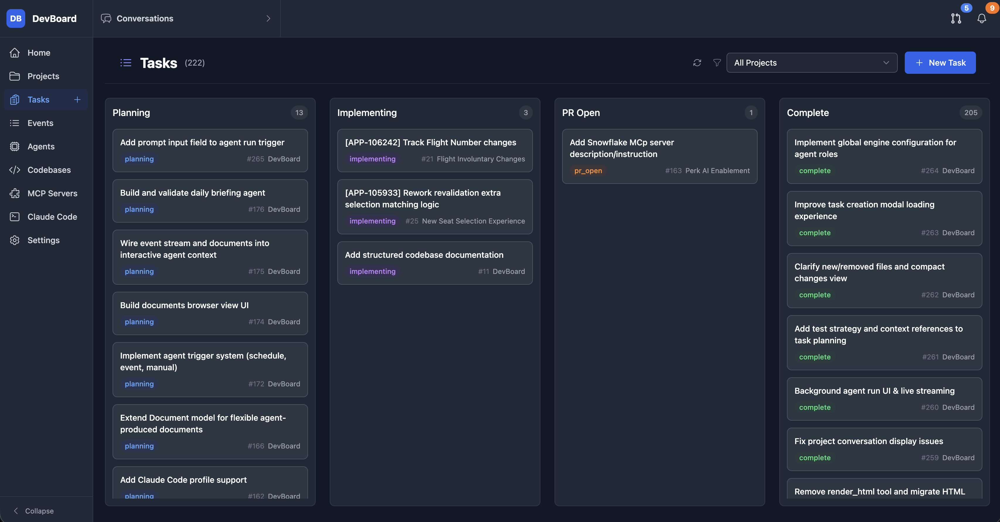
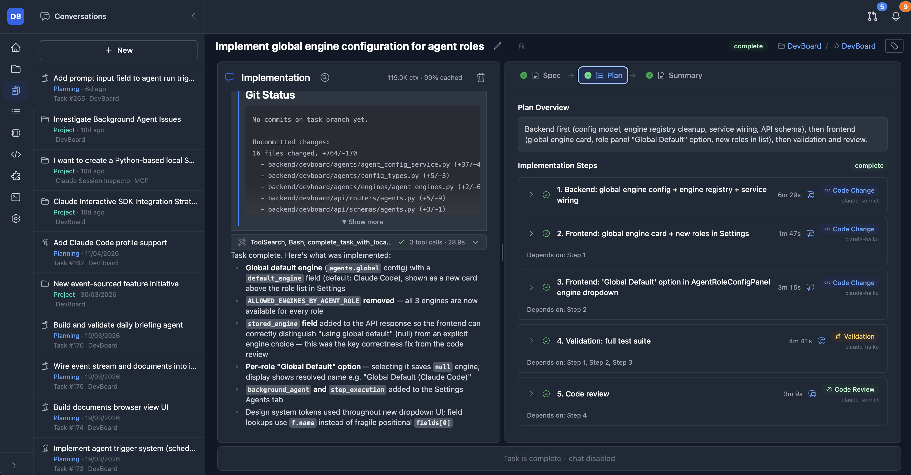
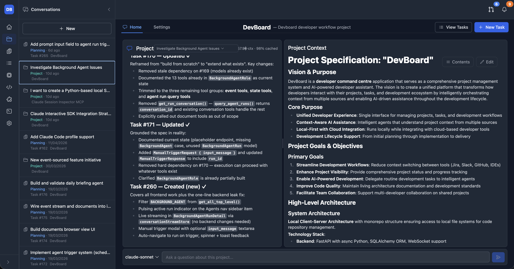
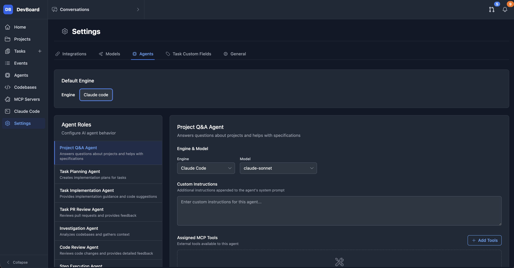
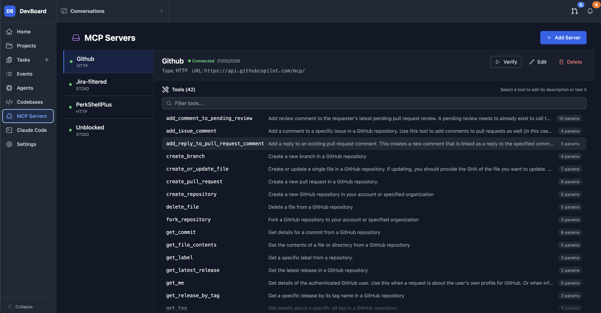
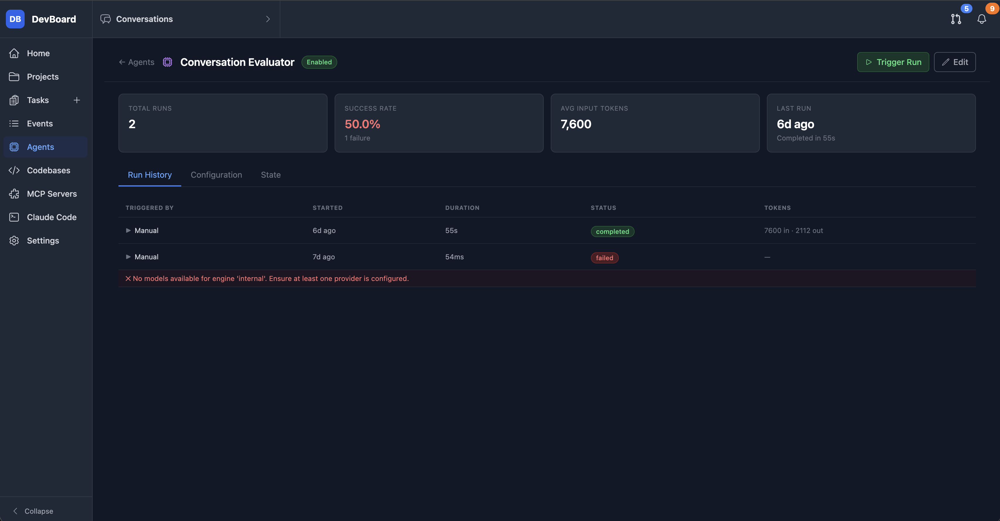
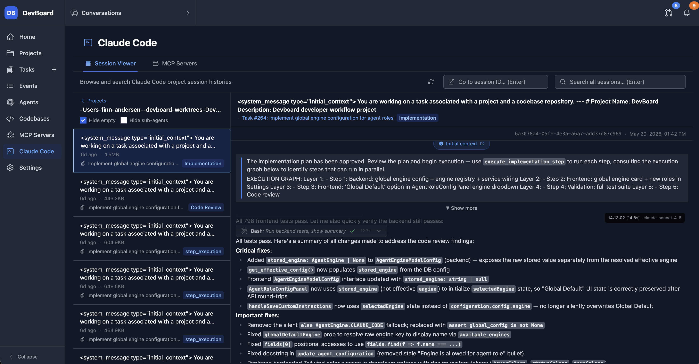
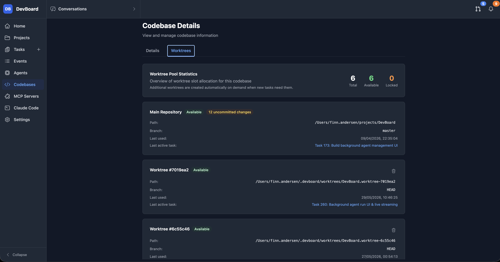
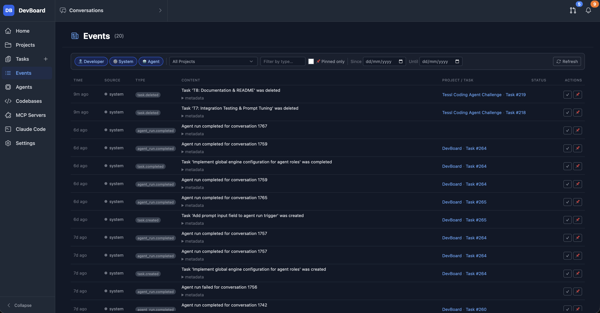

# DevBoard

## Overview

DevBoard is a **local-first developer command centre** that structures the software development workflow around AI agents. Rather than a generic chat interface, DevBoard formalises each task into a guided lifecycle — investigation, specification, implementation planning, and PR review — with specialised AI agents driving each phase.

Agents run on your choice of engine and model, and are fully configurable per role with custom instructions. **The default engine is Claude Code SDK**, which uses your existing Claude Code / Claude.ai Pro subscription with no separate API key required. Automatic git worktree management keeps agent workspaces isolated and ready. Background agents let you automate recurring work with manual, scheduled, or event-based triggers.

## Key Features

### 🗂 Structured Task Lifecycle
- **Spec → Plan → Implement → PR** workflow with distinct task states: Planning, Implementing, PR Open, Complete
- Each task maintains living documents: a **specification**, a structured **implementation plan** with step-by-step sub-agent execution and status tracking, and a **change summary**
- Auto-generated task names, branch names, and model selection from an initial prompt
- Automatic **git worktree / workspace management** — each task gets an isolated workspace from a managed pool, with sticky reuse across sessions
- **Diff viewer and change approval** flow before committing or creating PRs
- First-class **GitHub integration**: PR creation, PR status tracking, and PR review within the task view

### 🤖 Multi-Engine Agent System
- **Three execution engines**: built-in PydanticAI (multi-provider LLM), Claude Code CLI/SDK (Anthropic), Gemini CLI (Google)
- **Claude Code SDK is the default engine** — uses your existing Claude Code / Claude.ai Pro subscription, no separate Anthropic API key needed
- **Interactive mode** runs the agent via a tmux terminal session, billing through your Claude subscription rather than consuming programmatic API credits
- Independently configure **engine, model, and custom instructions** for each agent role: Project Q&A, Task Investigation, Task Specification, Task Planning, Task Implementation, Code Review, Step Execution, and Background Agent
- **Tiered model selection**: Fast / Standard / Advanced tiers across Anthropic, OpenAI, and Google providers
- Global default engine config with per-role overrides
- Transparent **tool approval workflow**: agents surface tool calls for user confirmation before execution
- Bash commands run in an **OS-level sandbox** by default for filesystem and network isolation

### ⏰ Background Agents
- Define agents with **manual, scheduled (cron), or event-based triggers** (pattern-matched on incoming events)
- Persistent agent state across runs; full run history with status tracking
- Configurable engine, model, and MCP tool access per background agent

### 🔌 MCP Server Management & Proxy
- Manage **STDIO and HTTP MCP servers** with connection verification and OAuth 2.0 support
- **Assign individual MCP tools to specific agent roles** — fine-grained control over what each agent can access
- Cached tool registry with live status; built-in **tool testing interface**

### 📋 Project & Task Management
- **Project-level context documents** maintained collaboratively with AI — capture architecture, conventions, and current state to ground task agents
- **Kanban-style task board** across all lifecycle states with filtering by project and status
- **Active conversations sidebar** with unread indicators and live streaming status
- Cross-entity agent tools: agents can read other tasks, project docs, and conversation history for shared context

### 🛠 Developer Tooling
- **Claude Code session viewer**: browse active and historical Claude Code sessions and inspect sub-agent conversations
- **MCP server dashboard** with tool browser and test interface
- **HTML, Mermaid diagram, and SVG rendering** inline in conversations for design mockups and architecture diagrams
- Dark/light theme with system preference detection
- Keyboard shortcuts for power-user navigation (Cmd+1–9, Cmd+W, Cmd+T)

## Screenshots

<table>
<tr>
<td width="50%">

**Kanban task board** — tasks across Planning, Implementing, PR Open, and Complete states


</td>
<td width="50%">

**Task agent with implementation plan** — structured steps with git status, spec, plan, and summary tabs


</td>
</tr>
<tr>
<td width="50%">

**Project Q&A agent** — chat with a project-level agent that has full access to the project specification


</td>
<td width="50%">

**Agent configuration** — per-role engine, model, custom instructions, and assigned MCP tools


</td>
</tr>
<tr>
<td width="50%">

**MCP server management** — connect to external MCP servers and browse their tools


</td>
<td width="50%">

**Background agent run history** — success rate, token usage, and run log per agent


</td>
</tr>
<tr>
<td width="50%">

**Claude Code session viewer** — browse active and historical Claude Code sessions and sub-agent conversations


</td>
<td width="50%">

**Codebase worktree pool** — view and manage the git worktree pool with per-slot status and last-used task


</td>
</tr>
<tr>
<td width="50%">

**Events log** — filterable stream of developer, system, and agent events used to trigger background agents


</td>
<td></td>
</tr>
</table>

## Architecture

DevBoard is a **local client-server application** — all data and processing runs on your machine.

### Backend
- **Framework**: FastAPI with async Python, SQLAlchemy 2.0 ORM
- **AI**: PydanticAI with multi-provider LLM support (Anthropic, OpenAI, Google)
- **Database**: SQLite
- **Streaming**: WebSocket + NDJSON event streaming for live agent output
- **Observability**: Pydantic Logfire instrumentation

### Frontend
- **Framework**: React 19 with TypeScript, Vite
- **State**: Zustand with Immer, normalised entity caching
- **Styling**: Tailwind CSS with custom design system
- **Testing**: Vitest + React Testing Library + MSW

### Key Patterns
- **Layered architecture**: API routers → Services → Repositories
- **Agent-driven workflows**: specialised roles with pluggable execution engines
- **Worktree pool**: pre-allocated git worktrees for fast task workspace allocation
- **Polymorphic conversations**: unified conversation system across all entity types

## Getting Started

### Prerequisites
- Python 3.12+
- Node.js (LTS)
- [uv](https://docs.astral.sh/uv/) — Python package manager
- A [Claude Code](https://claude.ai/code) subscription (recommended) or API keys for your preferred LLM provider

### Quick Start

1. **Clone the repository**:
   ```bash
   git clone <repository-url>
   cd DevBoard
   ```

2. **Run setup** (installs dependencies, runs migrations):
   ```bash
   ./setup.sh
   ```

3. **Start development servers**:
   ```bash
   ./start.sh
   ```

4. **Open DevBoard**:
   - App: http://localhost:5173
   - API docs: http://localhost:8000/docs

### Configuration

The default engine is Claude Code SDK, which uses your existing Claude Code subscription — no additional API keys required. To use alternative LLM providers, configure them via the Settings interface or environment variables:

```bash
# Optional: alternative LLM providers
ANTHROPIC_API_KEY=your_anthropic_key   # for internal PydanticAI engine with Claude
OPENAI_API_KEY=your_openai_key
GOOGLE_API_KEY=your_google_key

# GitHub integration
GITHUB_TOKEN=your_github_token
```

See `.env.example` for the full list of options.

## Development

```bash
# Backend
cd backend
make install      # install dependencies
make lint         # auto-fix formatting/lint (ruff)
make typecheck    # type-check (ty)
make test         # run test suite

# Frontend
cd frontend
pnpm install
pnpm dev          # dev server with HMR
pnpm test         # run tests
pnpm build        # production build
```

## Documentation

- **[Architecture](docs/3-architecture/)**: System design and implementation details
- **[AI Agents](docs/4-ai-agents/)**: Agent system, roles, engines, and tool configuration
- **[Features](docs/2-features/)**: Full feature documentation
- **API docs**: `/docs` when the backend is running

## License

[License information to be added]

## Issues & Feedback

Please [open an issue](../../issues) on GitHub for bugs, questions, or feature requests.
